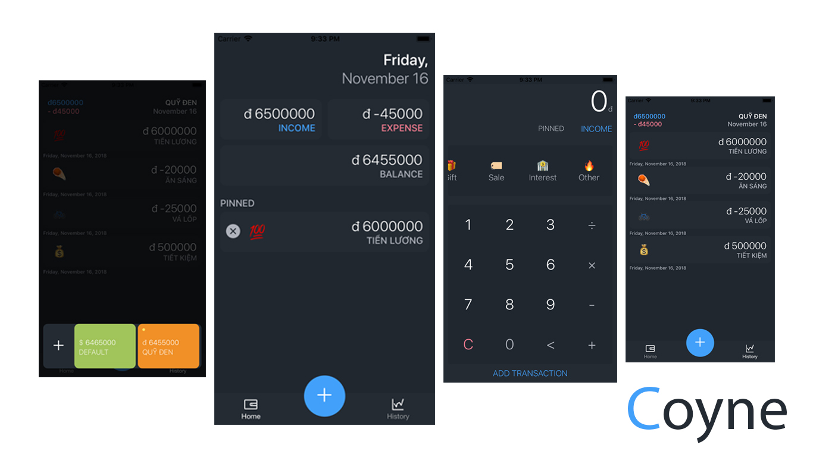

# Coyne

> Project PRM391 - FPT University

## Introduction

Coyne application is designed to help you to management your money.

#### Device Compatibility

- Android >= 5.0
- iOS >= 10

## Ecosystem

- [Expo SDK 31](https://expo.io/)
- [React Native 0.57](https://facebook.github.io/react-native/)

## Contributor

- Nguyễn Đắc Sang - [Evan N](https://www.facebook.com/dacsang97)
- Phạm Văn Tuấn - [Aupous](https://www.facebook.com/tuan.phamvan.m)
- Trần Tuấn Mạnh - [Strong Tran](https://www.facebook.com/profile.php?id=100009075589077)

## Contributing

### Good First Issues

To help you get your feet wet and get you familiar with our contribution process, we have a list of good first issues that contain bugs which have a relatively limited scope. This is a great place to get started.

## License

Coyne is [MIT License](https://github.com/dacsang97/coyne/blob/master/LICENSE)
